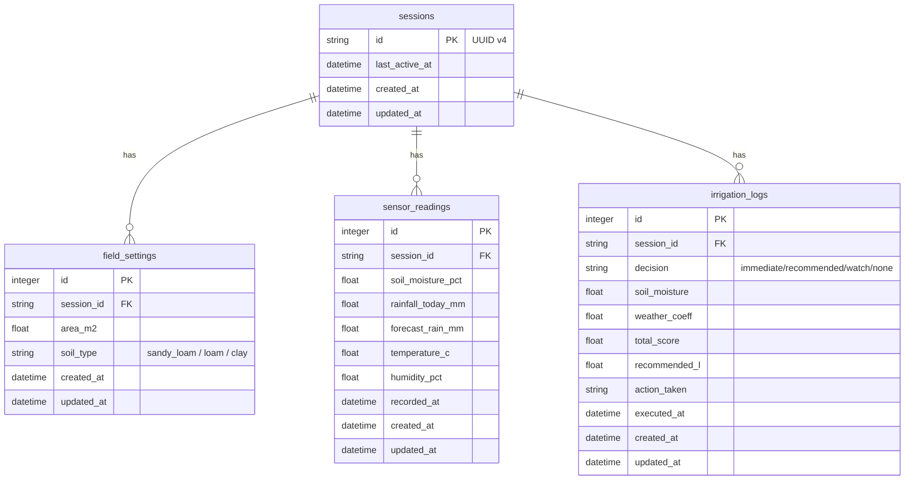
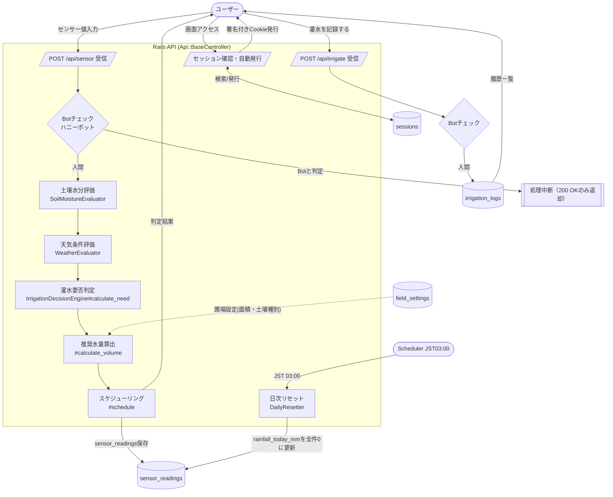
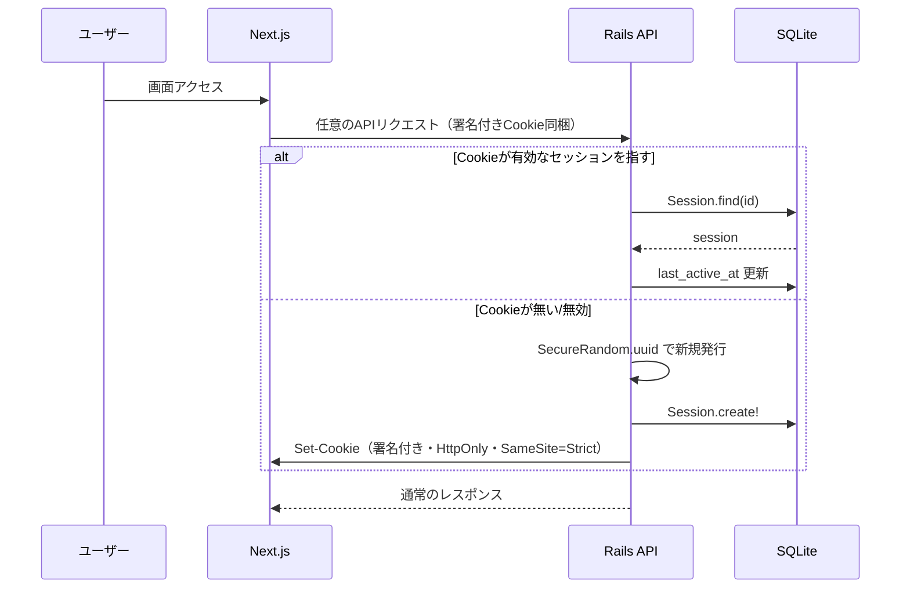
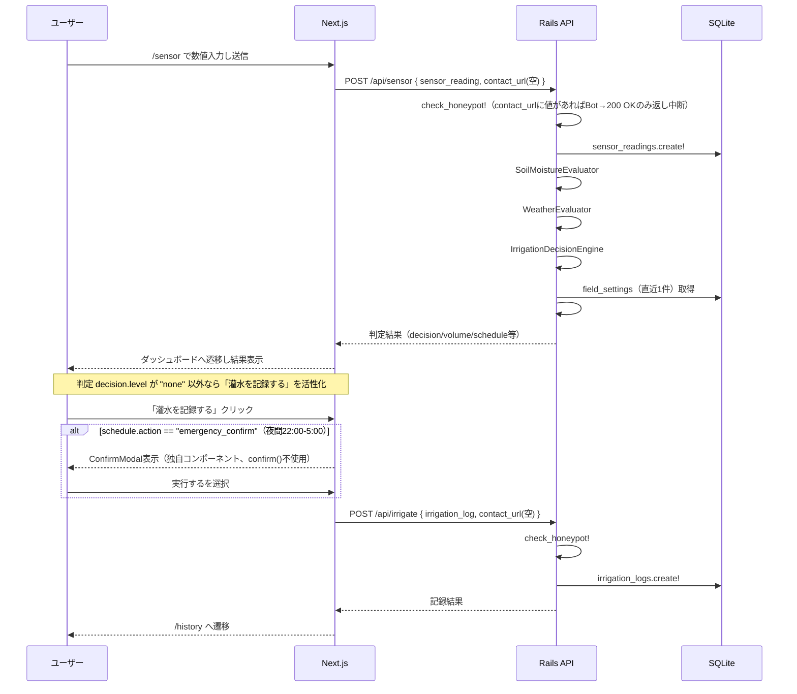
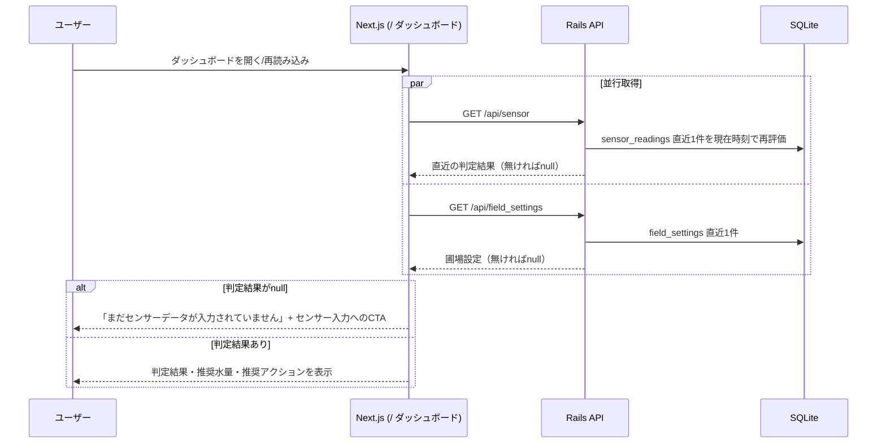
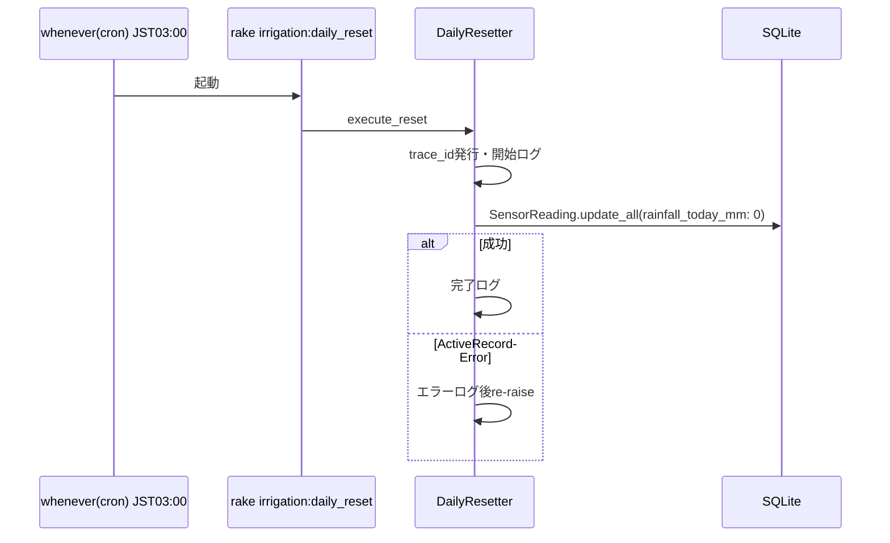
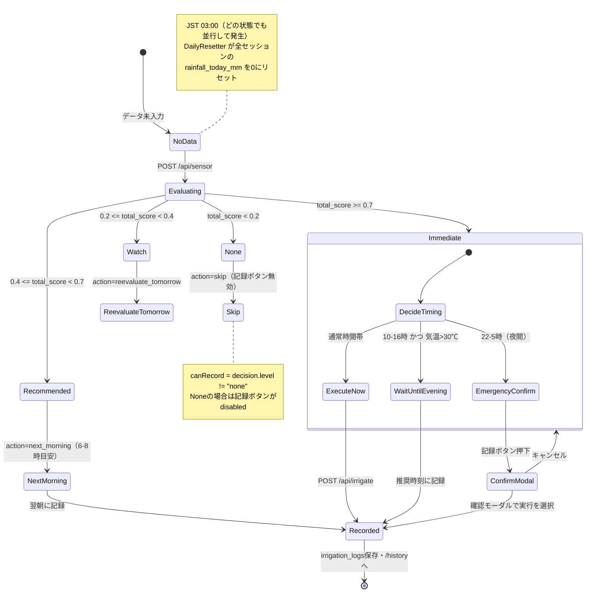
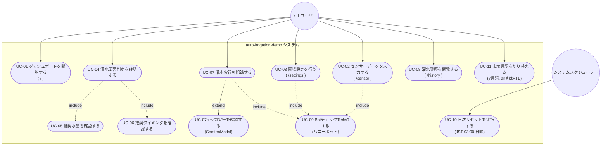

# 実装反映図（as-built）

`/auto-irrigation-demo-spec.md`（初期設計書）のASCIIアート図を、実装（`src/backend`, `src/frontend`）の内容に合わせて更新したもの。Mermaid記法で記述する（`.claude/rules/project-structure.md`）。

設計時点からの主な差分:

- カラム名 `recommended_L` → 実装では Rails 命名規約により `recommended_l`。
- `field_settings` / `sensor_readings` / `irrigation_logs` に `created_at`/`updated_at`（ActiveRecordの標準タイムスタンプ）が実装で追加されている。
- `GET /api/session`・`GET /api/field_settings`・`GET /api/sensor` が実装で追加されている（設計時点はPOST/判定系のみを想定）。ダッシュボード（`/`）は再読み込み時にこの2件のGETを並行取得して直近の判定結果を復元する。
- ハニーポットチェック（`check_honeypot!`）は各コントローラの `create` アクションでのみ呼ばれ、`show`（GET）系では呼ばれない。
- 判定ロジックの閾値・係数は `config/irrigation_rules.yml` に外部化されている（コーディング規約によりハードコード禁止のため）。
- 夜間時間帯（JST 22:00〜5:00）の「今すぐ灌水」判定は `emergency_confirm` となり、フロントエンドの `ConfirmModal` で確認を挟んでから記録する（ネイティブ`confirm()`は使用禁止のため独自コンポーネント）。

---

## 1. ER図

`soil_types`・`irrigation_levels` はテーブル化せず、`FieldSetting::SOIL_TYPES` / `IrrigationLog::DECISIONS`（Rubyの配列定数）およびUI表示文言 `messages/*.json` として実装されている（設計書の「マスタデータ定義」に対応）。

---

## 2. DFD（データフロー図）

---

## 3. シーケンス図

### 3.1 セッション自動発行（全APIリクエスト共通・`Api::BaseController#ensure_session!`）

### 3.2 メインフロー（センサー入力 → 灌水判定 → 記録）

### 3.3 ダッシュボード再読み込み（設計時点になかった追加フロー）

### 3.4 日次リセットフロー

---

## 4. クラス図

```mermaid
classDiagram
    class IrrigationRules {
        <<module>>
        +load() Hash
    }
    class HoneypotConfig {
        <<module>>
        +load() Hash
    }

    class SoilMoistureEvaluator {
        -thresholds: Array
        +validate(moisture) Boolean
        +evaluate(moisture) Result
    }
    class WeatherEvaluator {
        -rules: Hash
        +validate(...) Boolean
        +evaluate(rainfall_today_mm, forecast_rain_mm, temperature_c, humidity_pct) Result
    }
    class IrrigationDecisionEngine {
        -levels: Array
        -water_volume: Hash
        -schedule_rules: Hash
        +calculate_need(soil_score, weather_coefficient) NeedResult
        +calculate_volume(level, area_m2, soil_type) VolumeResult
        +schedule(level, current_hour_jst, temperature_c) ScheduleResult
    }
    class SessionManager {
        +generate_session_id() String
        +validate_session(session_id) Boolean
        +scope_query(relation, session_id) ActiveRecord::Relation
    }
    class HoneypotChecker {
        -field_name: String
        +check(form_data) Result
    }
    class DailyResetter {
        -reset_hour_jst: Integer
        +execute_reset() Boolean
        +due?(time_jst) Boolean
    }

    IrrigationDecisionEngine ..> IrrigationRules : load
    SoilMoistureEvaluator ..> IrrigationRules : load
    WeatherEvaluator ..> IrrigationRules : load
    DailyResetter ..> IrrigationRules : load
    HoneypotChecker ..> HoneypotConfig : load
    DailyResetter ..> SensorReading : update_all

    class ApiBaseController {
        <<Api::BaseController>>
        #current_session
        #ensure_session!()
        #scoped(relation)
        #check_honeypot!()
    }
    class ApiSessionsController {
        <<Api::SessionsController>>
        +show()
    }
    class ApiFieldSettingsController {
        <<Api::FieldSettingsController>>
        +show()
        +create()
    }
    class ApiSensorReadingsController {
        <<Api::SensorReadingsController>>
        +show()
        +create()
    }
    class ApiIrrigationsController {
        <<Api::IrrigationsController>>
        +create()
    }
    class ApiIrrigationLogsController {
        <<Api::IrrigationLogsController>>
        +index()
    }

    ApiBaseController <|-- ApiSessionsController
    ApiBaseController <|-- ApiFieldSettingsController
    ApiBaseController <|-- ApiSensorReadingsController
    ApiBaseController <|-- ApiIrrigationsController
    ApiBaseController <|-- ApiIrrigationLogsController

    ApiBaseController --> SessionManager
    ApiBaseController --> HoneypotChecker
    ApiSensorReadingsController --> SoilMoistureEvaluator
    ApiSensorReadingsController --> WeatherEvaluator
    ApiSensorReadingsController --> IrrigationDecisionEngine

    class Session {
        +id: String
        +last_active_at: DateTime
    }
    class FieldSetting {
        +area_m2: Float
        +soil_type: String
    }
    class SensorReading {
        +soil_moisture_pct: Float
        +rainfall_today_mm: Float
        +forecast_rain_mm: Float
        +temperature_c: Float
        +humidity_pct: Float
        +recorded_at: DateTime
    }
    class IrrigationLog {
        +decision: String
        +soil_moisture: Float
        +weather_coeff: Float
        +total_score: Float
        +recommended_l: Float
        +action_taken: String
        +executed_at: DateTime
    }

    Session "1" --> "*" FieldSetting
    Session "1" --> "*" SensorReading
    Session "1" --> "*" IrrigationLog
```

---

## 5. 状態遷移図

### 灌水判定の状態遷移（`schedule.action` は `IrrigationDecisionEngine#schedule` の戻り値）

---

## 6. ユースケース図

